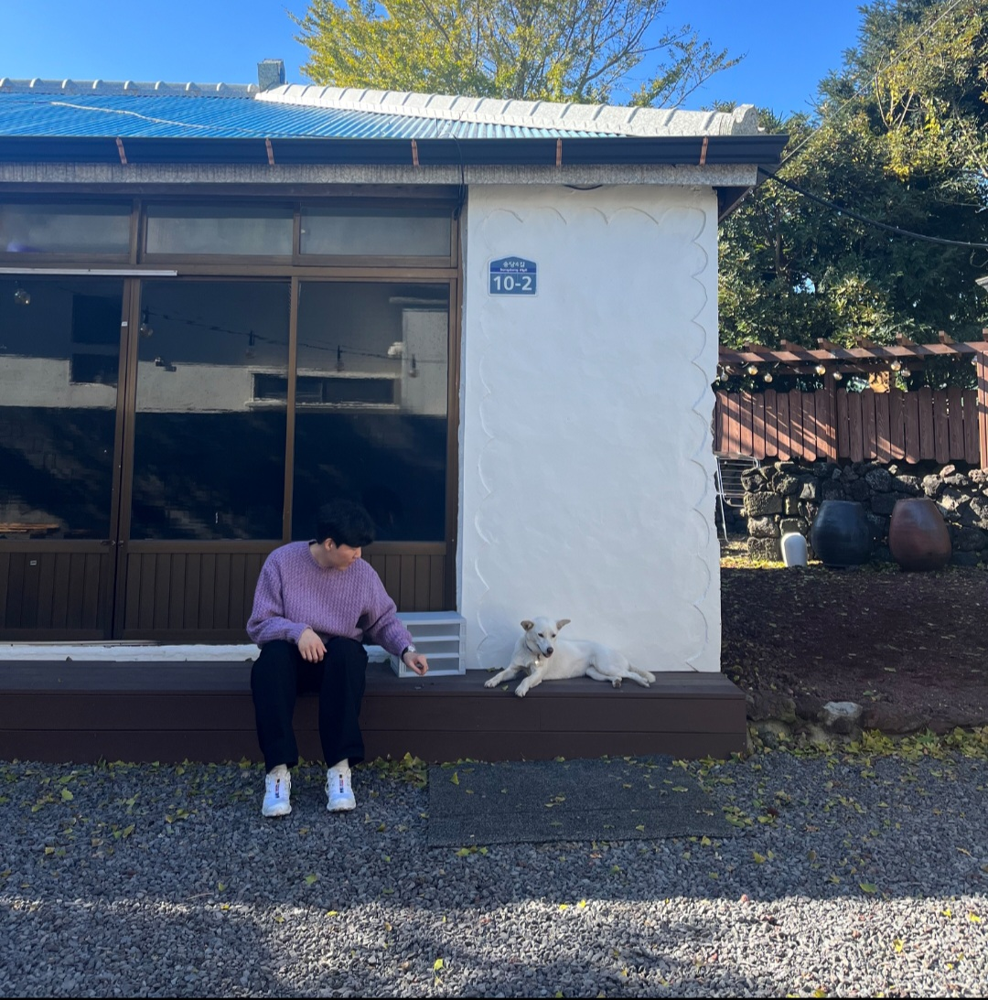

  <h1>About Me</h1>

  

   

  <h2>Project & Career</h2>

# 티라로보틱스 2023.09.01 ~ 재직중
> WRS(Warehouse Robot Solution)  - 2023.02 ~ 2024.03

: Jquery로 개발된 레거시 시스템에서 조회 기능이 6~7초 소요되던 문제를 react로 refactoring하여 1초 미만 소요되는 것을 검증했습니다.  
  Next.js + TypeScript로 refactoring에 필요한 라이브러리(EChart, AgGrid)를 조사하여 채택하고 코드의 일관성과 가독성을 높이기 위해 
  코드 컨벤션을 적용하는 등 프로젝트 초기 단계부터 구축했습니다.
  * line, pie, mixed 등 chart 공통 컴포넌트 개발
  * AgGrid 공통 컴포넌트 개발
  * input, select, datePicker 공통 컴포넌트 개발
  * 코드 컨벤션 적용 및 TypeScript 설정

&#10003; Frontend : NextJS, TypeScript  
 

> Map Editor  - 2023.03 ~ 2024.08

: Three.js를 사용하여 AMR 주행에 필요한 노드, 링크, 오브젝트를 캔버스에 시각화하고 편집할 수 있는 Map Editor를 개발했습니다. 
  XY 축을 따라 오브젝트를 이동 및 회전할 수 있는 컨트롤러와, 방향키와 마우스 클릭으로 AMR 조작이 가능한 조이스틱 컴포넌트를 구현했습니다.
  * 파일 구조에 배럴 배턴 적용
  * Three.js를 사용하여 노드및 링크 생성
  * AMR 조작을 위한 조이스틱 컴포넌트 개발
  * Axios를 활용한 HTTP 메소드별 Hook 개발
  * 프로젝트에 필요한 RESTful API 호출 함수 작성
  * 캔버스 이벤트 바인딩 관리, snackBar Provider 구현
  * 개발 효율성을 높이는 공통 유틸리티 함수 
  * 코드 컨벤션 적용 및 TypeScript 설정
  * display flex를 이용하여 반응형 layout 구축

  팀원들이 기능 개발에 집중할 수 있도록 프로젝트를 주도하고, 일정 관리 및 업무 할당을 수행했습니다.

&#10003; Frontend : React, TypeScript, SASS  
  

---
# React Toy Project 2023.05.19 ~ 2023.08.01 (약 3개월)
> 넷플릭스를 모티브로 React Frontend 개발

: React 공부를 목적으로 넷플릭스를 참고하여 Backend없이 Frontend만 개발했습니다. 
  1. 구글 계정으로 로그인이 가능하도록 구글 로그인 연동 기능 개발
  2. 영화 제공이 불가능하므로 KMDB API를 사용하여 영화 예고편을 제공하고 video태그 사용
  3. infinite scroll기능 개발
  4. 영화 제목 검색 기능 개발
  5. EC2 free tier를 이용하여 배포하고 웹 서버는 NginX를 사용했습니다.

&#10003; Frontend : React, JavasScript, Redux ToolKit, CSS  
&#10003; Deployment : Amazon EC2, NginX  
&#10003; GitURL : <a href="https://github.com/k-min-ju/react_project" target="_blank">J-MOVIE</a>  
  

---
#  나온소프트 2021.02 ~ 2023.05 (약 2년 4개월) 
> 그룹웨어, 메신저 개발 및 유지보수

: 그룹웨어 전자 결재와 고객사 ERP 연동을 위해 Rest API를 개발하였습니다.
장애 발생 시 Scouter로 오류를 분석하여 Backend 로직을 개선하고 슬로우 쿼리 발생 시 Query Plan을 활용하여 인덱싱 작업 및
쿼리 개선을 진행했습니다. JQuery, JavasScript, Mustache로 그룹웨어 및 메신저를 개발하며 제품 향상에 기여하였습니다.

&#10003; Frontend: JQuery, JavasScript, Mustache, HTML, CSS  
&#10003; Backend: Spring, Spring Boot  
&#10003; DBMS: Oracle, MariaDB  
  

---
#  나우티앤에스 2018.01 ~ 2021.02 (약 3년 2개월)
> 귀뚜라미 보일러 CS Hybrid App Renual - 2020.04 ~ 2020.07 (약 4개월)

: 대댓글 작성이 가능한 게시판, 공지사항, 설문조사 모듈과 관리자 페이지를 개발하여 본사 임직원과 AS 기사분들의 소통을 강화했습니다.

&#10003; Frontend: JQuery, JavaScript, HTML, CSS  
 

> LG생활건강 백화점 재고 실사 Hybrid App - 2019.09 ~ 2019.12 (약 4개월)

: 재고 실사 특성을 고려하여 네트워크 연결 없이도 웹 페이지를 사용할 수 있도록 로컬 웹페이지 방식으로 개발하였으며
PDA의 barcode scan기능을 활용하여 1차원, 2차원 barcode scan 기능을 구현했습니다.

&#10003; Frontend: JQuery, JavasScript, HTML, CSS  
 

> 현대 중국 법인 엘리베이터 관리 Hybrid App - 2018.06 ~ 2018.08 (약 3개월)

: 엘리베이터 고장 관리, 점검 관리, 작업 관리 등 기사분들이 작업 내역을 관리할 수 있는 App을 개발하였으며
중국 상해에서 배포 및 안정화를 수행하였습니다.

&#10003; Frontend: JQuery, JavasScript, HTML, CSS  
 

> 귀뚜라미 보일러 CS Hybarid App 결제 연동 2018.03 ~ 2018.05 (약 3개월)

: 귀뚜라미 보일러 App에서 결제 요청 시 모바일 디바이스와 프린터 기기를 블루투스로 연결하여 
결제 App을 띄우는 App to App 방식으로 개발하였습니다.
결제가 완료되면 영수증이 자동 출력되도록 하고 완료 값을 return받아 중복 결제 방지를 처리했습니다.

&#10003; Frontend: JQuery, JavasScript, HTML, CSS  
  

---
>  비자림 2016.11 ~ 2018.01 (약 1년 3개월)

: 구매 관리, 생산 관리, 재고 관리 등 공장 프로세스를 적용한 ERP시스템을 개발했습니다.
개발에 필요한 쿼리를 작성하고 서버를 설치하여 고객사에 배포했습니다.

&#10003; Frontend: ExtJs, JavasScript, HTML, CSS  
  

---
  

  <h2>Stacks</h2>

<!--
 
 
 
 

 
-->

 
 
 
 
 
 
